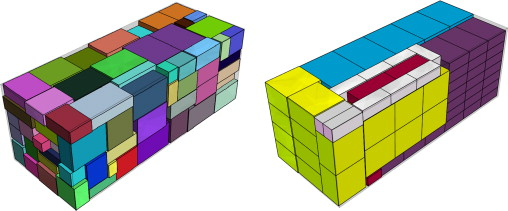
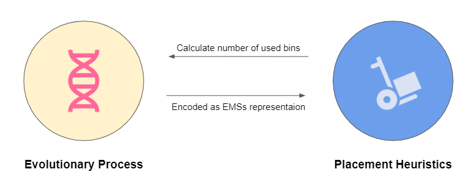
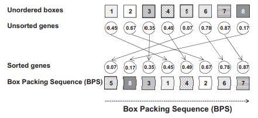
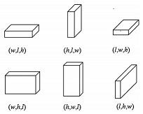
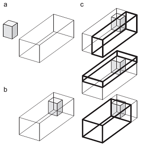
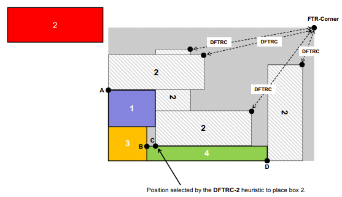
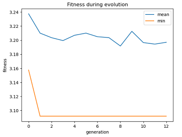

# Tutorial of BRKGA for 3D-Bin Packing Problem

<details open="open">
  <summary><b>Table of Contents</b></summary>
  <ol>
    <li>
      <a href="#introduction">Introduction</a>
    </li>
    <li>
      <a href="#problem-description">Problem Description</a>
    </li>
    <li>
      <a href="#methodology">Methodology</a>
      <ul>
        <li><a href="#biased-random-key-enetic-lgorithmn">Biased Random-Key Genetic Algorithmn</a></li>
        <li><a href="#placement-strategy">Placement Strategy</a></li>
      </ul>
    </li>
    <li><a href="#visualization">Visualization</a></li>
    <li><a href="#conclusion">Conclusion</a></li>
  </ol>
</details>

# __Introduction__

This repository is a tutorial for the implementation of __Biased Random Key Genetic Algorithmn for 3D Bin Packing Problem__ based on heuristic and design propsed from the paper _"A biased random key genetic algorithm for 2D and 3D bin packing problems"_  by [Gonçalves & Resende (2013)]("https://www.sciencedirect.com/science/article/abs/pii/S0925527313001837?via%3Dihub"). I wrote this tutorial as a showcase of application for the course "_Operations Research Applications and Implementation_" intructed by professor _Chia-Yen Lee_. It is not for commercial use. If there is any sign of copyright infringement, please inform me as I will remove the repository.

## __Outline__

I will first define the problem statement of 3D-bpp. Next, I will introduce the idea of __Biased Random-Key Genetic Algorithmn (BRKGA)__ and __Placement Strategy__ proposed in the paper with code and example. Finally, the visualization for instance solution is presented.

## __Prerequisites__

My implementation is entirely based on Python code, with used of default module that can be found in most Python distribution, which means no external library is required. However, the reader should have basic understanding of __genetic algorithmn__, namely the idea of chorosome representation, encoding & decoding process, and evolutionary process. For more details, Tutorialspoint had a great [article](https://www.tutorialspoint.com/genetic_algorithms/genetic_algorithms_quick_guide.htm) as the introduction of GA.

# __Problem Description__

## __Three Dimensional Bin-Packing Problem__

<p style="text-align:center">
  
  <center>"example of bin packing problem" from <a href="https://www.sciencedirect.com/science/article/abs/pii/S0925527313001837?via%3Dihub">[Gonçalves & Resende (2013)]</a></center>
</p>

In a three dimensional bin-packing problem, items (or boxes) with different volumes must be orthogonally packed into a set of bins (or containers) with fixed volume, in a way that __minimizes the number of total used bins__. The "three dimensional" means the volumes of each item consist of 3 dimension, namely depth, width and height.

This problen is strongly __NP-hard__ (as it generalize from 2D-bpp and 1D-bpp, which are also NP-hard), meaning a faster heuristic is prefered even with the existence of a mixed integer programming formulation that can garuantee an optimal solution. Given this idea, the genetic algorithmn, one of the most common heuristic for combinatorial problem, can be applied to slove the problem in acceptable amount of time, though it does not ensures an optimal solution.

## __Input__

In 3D-bpp, there are _n_ rectangular boxes with length in three dimensions _(d, w, h)_, and a fixed-size container where boxes are placed. Without loss of generality, we assume that all boxes to be packed are smaller than the container. For the implementation, simply use an object with two array of 3D vector to denote shape of boxes and containers respectively.

```python
inputs: {
 # boxes with different shape
 'v': [(188, 28, 58), (61, 9, 79), (188, 28, 58), ..., (145, 80, 96)],
 # containers with fixed shape
 'V': [(610, 244, 259), .., (610, 244, 259)]
}
```

# __Methodology__

The algorithmn for this article is composed of two parts, a __Biased Random-Key Genetic Algorithmn (BRKGA)__ to search the solution space, and a heuristic called __placement procedure__ to evalute each solution representation in GA. Briefly speacking, the algorithm encode each solution (packing scenario) by a sequence that can be evaluated by a heuristic, which enables __genetic algorithm__ to find good solution through selection. In this section, the setting of BRKGA and the idea of placement procedure will be discussed. 

<p style="text-align:center">
  
  <center>algorithmn architecture</center>
</p>

## __Biased Random-Key Genetic Algorithmn__

The BRKGA, proposed by [Gonçalves & Resende (2011)](https://link.springer.com/article/10.1007/s10732-010-9143-1), is essentially a derivative of genetic algorithm (GA) with extensions of _random-key_ representation and _biased_ selection from population pool. It is worth to notice that in most of the meta-heuristics for 3d-bpp, instead of representing every coordinates of items placed, they are designed to __find the best packing sequence__ (the order in which the items are packed) that follows a rule-based packing procedure like the Deepest Bottom-Left-Fill packing method. In this way, the representation of a solution can be greatly simplified, while empirically obtaining solution with good quality. In addition, the packing sequence can always be mapped to a feasible packing scenario without worrying about coordinates overlapping, meaning there is no need for chromosome-repairing in this GA implementation.

Next, I will explain the idea of Random Key, Biased Selection for BRKGA in the following pragragh.

### __Random-Key Representation__

The random key is a way to encode a chromosome (solution), where the solution are represented as a vector of real numbers within [0, 1]. Let assume the number of items to be packed is _n_. In this implementation, the length of a random key is always _2n_. With _Numpy_’s random number routines, we can easily generate random key representation in 1 line.

```python
# random key representation
solution = np.random.uniform(low=0.0, high=1.0, size= 2*n)
```

In each solution, the first _n_ genes, named **Box Packing Sequence (BPS)** by the author, represents the order of the _n_ items to be packed, and can be decoded by sorting in ascending order of the corresponding gene values (Fig. 3). We can use the _argsort_ method to obtain the indices of the sorted array.

```python
# sort by ascending order
box_packing_sequence = np.argsort(solution[:n])
```

<p style="text-align:center">
  
  <center><b>Fig. 3.</b> Decoding of the box packing sequence</center>
</p>
<p style="text-align:center">
  
  <center><b>Fig. 4.</b> Box orientation</center>
</p>

The last _n_ genes, named **Vector of Box Orientations (VBO)**, represent the orientation of the boxes. In the setting of three dimension, there are total six orientations (Fig. 4) to place a box. In some scenario, some boxes cannot be placed upside down, or limited by the vertical orientation, so to speak. To consider all possible orientations, the decoding of each gene (called _BO_) in _VBO_ is defined as
<p align="center">
  <b>selected orientation = BOs⌈BO×nBOs⌉</b><br>
</p>

, where _BO_ is the given value of _VBO_, _BOs_ denotes all possible orientations allowed for that box, and _nBOs_ is the number of _BOs_. Or in code:
```python
# value of BO
BO = 0.82

# posiible orientations
BOs = [1,2,3,4,5,6]

# selected orientation
orientation = BOs[math.ceil(BO*len(BOs))] # orientation = 5
```

In summary, _BRKGA_ use a vector of real numbers between [0,1] to represent a solution, which consist of __box packing sequence (BPS)__ with length of _n_, and __Vector of Box Orientations (VBO)__ also with length _n_. The former represents the order to pack the boxes, while representing the oreientation of corresponding box. With a packing procedure that will be explained later, a solution can converted to a real packing scenario whose quality can be further evaluated.

### __Biased Selection__

The most noticeable difference between BRKGA and other genetic algorithmn implementations are the fact that the population in each generation is partitioned into two group, __Elite__ and __Non-Elite__, based on the fitness value. This biased selection will greatly influence operations in GA such as crossover and survivor selection that will be explained latter.  For now, let's define a function to partition the population into elite and non-elite group based on the fitness value and the number of elite individual denoted as _num_elites_.

```python
def partition(population, fitness_list, num_elites):
    # sorted indices based on fitness value
    sorted_indexs = np.argsort(fitness_list)
    # return elite & non-elite group
    return population[sorted_indexs[:num_elites]], population[sorted_indexs[num_elites:]]
```

### __Crossover__

In _BRKGA_, the __parameterized uniform crossover__ is used to implement the crossover operation. For each mating, there will always be one parent chosen from the _Elite_ and the other from  the _Non-Elite_. Then, it will create an offspring whose _i-th_ gene is inherited the _i-th_ gene from either elite parent or non-elite one based on a prespecified probality denoted as _eliteCProb_. Generally, this probability will favor the inheritance from the elite parent. For the implementation, I define a function to select parents, and a function to perform crossver given the selected parents.

```python
def crossover(elite, non_elite):
    # initialize chromosome
    offspring = [0]*(2*n)

    # choose each gene from elite and non_elite
    for i in range(2*n):
      # inherit from elite with probability of eliteCProb
      if np.random.uniform(low=0.0, high=1.0) < eliteCProb:
          offspring][i] = elite[i]
      else: 
          offspring][i] = non_elite[i]
    return offspring

def mating(self, elites, non_elites):
    offspring_list = []
    num_offspring = num_individuals - num_elites - num_mutants
    for i in range(num_offspring):
        # biased selection for parents: 1 elite & 1 non_elite
        offspring = crossover(random.choice(elites), random.choice(non_elites))
        offspring_list.append(offspring)
    return offspring_list
```

The number of offsprings (from crossover) depends on the number of individuals in each population (_num_individuals_) and the number of mutants (_num_mutants_) that will be explained in the next section.

### __Mutants__

Instead of performing mutation operation (e.g. swap mutation), the authors create new individuals that are randomly generated in each generation as a mean to add randomness into the population. Given the number of mutants, denoted as _num_mutants_, we can define a function to create new individuals like how we initialize the population.

```python
def mutation(num_mutants):
    # return mutants
    return np.random.uniform(low=0.0, high=1.0, size=(num_mutants, 2*n))
```

### __Evolutionary Process__

For each generation, all elite individuals are kept for the next population without any modification. In addition, mutants and offsprings created from crossover are directly added to the next population. Since the problem is about minimizing the number of used bins, we will update the minimum fitness value in each generation. Together, we can define the function for evolutionary process as:

```python
def evolutionary_process(n, num_generations, num_individuals, num_elites, num_mutants):
    
    # initialization
    ## initial poulation
    population = np.random.uniform(low=0.0, high=1.0, size=(num_individuals, 2*n))
    
    ## calculate fitness function
    fitness_list = cal_fitness(population)
    
    ## minimum fitness value
    best_fitness = min(fitness_list)

    for g in range(num_generations):
        
        # seperate elite group & non-elite group
        elites, non_elites = partition(population, fitness_list, num_elites)
        
        # biased mating & crossover
        offsprings = mating(elites, non_elites)

        # generate mutants
        mutants = mutation(num_mutants)

        # next population
        population = np.concatenate((elites, mutants, offsprings), axis=0)
        
        # calculate fitness
        fitness_list = cal_fitness(population)

        # update minimum fitness value
        for fitness in fitness_list:
            if fitness < best_fitness:
                best_fitness = fitness
```

The only element has not yet been mentioned is how to evaluate the fitness value of a solution (with function _cal_fitness_). Remember a solution tells us the order (_BPS_)  and the orientations (_VBO_) of the boxes to be packed. In order to evaluate the fitness function for each solution, we simply try to pack those boxes by following exactly the info provided in the solution, and then count how many containers are used. Therefore, we require a __system to pack boxes in three dimension into fixed-size containers by following the instruction of a solution__. This system is called _Placement Procedure_ and will be discussed in the following section.

## __Placement Strategy__

In terms of implementation and intricacy, perhaps the placement procedure is more complex than GA. First, it requires a model to reflect the rectangle boxes and containers in three dimentions with while identifying condition of overlapping and out-of-bound. Second, a heuristic rule to place the boxes must be define. Last, two compoment mentioned above and other states must all be put into integration. Let's start with the model that is specifically designed for 3D dimension placement in this problem.

### __Maximal-Spaces Representation__

The maximal-space is a concept to represent a rectangular space by its _minimum_ and _maximum coordinats_, which works only if the object is placed orthogonally to three dimensions as in this problem. For example, a box with shape of (10, 20, 30) placed in the origin can be encoded as:
```python
MS = [(0,0,0), (10,20,30)] # [minimum coordinats, maximum coordinates]
```

The heuristic — __difference process (DP)__ — developed by [Lai and Chan (1997)](https://www.sciencedirect.com/science/article/abs/pii/S0360835296002057) keeps track of boxes placement by recording available spaces left in the container called _Empty Maximal-Spaces (EMSs)_. With the use of _EMSs_, we can see box placement in a container as the collection of following processes:
  
  1. Select a _EMS_ from existing _EMSs_.
  2. Generate new _EMSs_ from the intersection of the box with existing EMSs and remove the intersected _EMSs_.
  3. Remove _EMSs_ which have infinite thinness (no length in any dimension), or are totally inscribed by other _EMSs_
  4. Remove _EMSs_ which are smaller than existing boxes to be placed.

For each pair of box (demote its space as _ems_) and intersected _EMS_ in _step 2._,  we can compute new  _EMSs_ as follow. Notice that there will be six empty space generated by the intersection in three dimentional space.

```python
# minimem & maximum coordinates for intersected EMS
x1, y1, z1 = EMS[0]
x2, y2, z2 = EMS[1]

# minimem & maximum coordinates for space of box
x3, y3, z3 = ems[0]
x4, y4, z4 = ems[1]

# six new EMSs for 3D space
new_EMSs = [
    [(x1, y1, z1), (x3, y2, z2)],
    [(x4, y1, z1), (x2, y2, z2)],
    [(x1, y1, z1), (x2, y3, z2)],
    [(x1, y4, z1), (x2, y2, z2)],
    [(x1, y1, z1), (x2, y2, z3)],
    [(x1, y1, z4), (x2, y2, z2)]
]
```

In practice, however, we will place the minimum coordinate of box against that of the selected _EMS_ (Fig. 5), because interspace between two boxes will usually result in unfit gap for others boxes. As the result, we will rewrite the prpcess as:

```python
# minimem & maximum coordinates for intersected EMS
x1, y1, z1 = EMS[0]
x2, y2, z2 = EMS[1]

# minimem & maximum coordinates for space of box
x3, y3, z3 = ems[0]
x4, y4, z4 = ems[1]

# three new EMSs for 3D space if ems[0] = EMS[0]
new_EMSs = [
    [(x4, y1, z1), (x2, y2, z2)],
    [(x1, y4, z1), (x2, y2, z2)],
    [(x1, y1, z4), (x2, y2, z2)]
]
```
<p style="text-align:center">
  
  <center><b>Fig. 5.</b> Example of Difference Process (rectangle with bold lines are the new EMSs resulting from the placement of the grey box)</center>
</p>

To check if a _EMS_ overlaps or is totally inscribed by another _EMS_, we can define the following functions to compute two conditions. (In the implmentation, every _EMS_ is converted into _numpy_ array to receive the property of element-wise boolean operations)

```python
def overlapped(EMS_1, EMS_2):
    if np.all(EMS_1[1] > EMS_2[0]) and np.all(EMS_1[0] < EMS_2[1]):
        return True
    return False

def inscribed(EMS_1, EMS_2):
    if np.all(EMS_2[0] <= EMS_1[0]) and np.all(EMS_1[1] <= EMS_2[1]):
        return True
    return False
```

In sum, the psuedo function for dfference process of a box placement with selected EMS can be written as:

```python
def difference_process(box, selected_EMS, existing_EMSs):

    # 1. compute maximal-space for box with selected EMS
    ems = [selected_EMS[0], selected_EMS[0] + boxToPlace]

    # 2. Generate new EMSs resulting from the intersection of the box 
    for EMS in existing_EMSs:
        if overlapped(ems, EMS):
          
          # eliminate overlapped EMS
          existing_EMSs.remove(EMS)

          # three new EMSs in 3D
          x1, y1, z1 = EMS[0]; x2, y2, z2 = EMS[1]
          x3, y3, z3 = ems[0]; x4, y4, z4 = ems[1]
          new_EMSs = [
              [(x4, y1, z1), (x2, y2, z2)],
              [(x1, y4, z1), (x2, y2, z2)],
              [(x1, y1, z4), (x2, y2, z2)]
          ]

          for new_EMS in new_EMSs:
              isValid = True

              # 3. Eliminate new EMSs which are totally inscribed by other EMSs
              for other_EMS in self.EMSs:
                  if self.inscribed(new_EMS, other_EMS):
                      isValid = False
              
              # 4. Remove _EMSs_ which are smaller than existing boxes to be placed
              ## (1) new EMS smaller than the volume of remaining boxes
              new_box = new_EMS[1] - new_EMS[0]
              if np.min(new_box) < min_dim:
                  isValid = False
              ## (2) new EMS having smaller dimension of the smallest dimension of remaining boxes
              if np.product(new_box) < min_vol:
                  isValid = False

              # add new EMS if valid
              if isValid:
                  existing_EMSs.append(new_EMS)
```

Now we have a way to update the state of container and boxes in 3D space after each box placement. Next, I will introduce a placement heuristic to decide which EMS to select for each box placement in a sequence of boxes. 

### __Placement Heuristic__

The _Back-Bottom-Left-Fill Heuristic_ is a rule to pack a sequence of boxes, in which it will always select the empty space with smallest minimum coordinates to fit the box. The heuristic aims to place box in the deepest space for each iteration in hope that all boxes will be placed tight together in the end.

As observed by [Liu and Teng (1999)](https://www.sciencedirect.com/science/article/abs/pii/S0377221797004372), some optimal solutions could not be constructed by this heuritic. To deal with this problem, [Gonçalves & Resende (2013)]("https://www.sciencedirect.com/science/article/abs/pii/S0925527313001837?via%3Dihub") developed an improved version of the placement heuristic rule named _Distance to the Front-Top-Right Corner (DFTRC)_. As the title suggests, the heuristc will always place the box in the empty space such that it maximizes the distance of the box to the maximal coordinates of the container (Fig. 6).

<p style="text-align:center">
  
  <center><b>Fig. 6.</b> Example of heuristic DFTRC placement rule</center>
</p>

The psuedo function for DFTRC placement rule is:

```python
# D, W, H are the depth, width and height of a container
def DFTRC(box, existing_EMSs):
    maxDist = -1
    selectedEMS = None
    for EMS in existing_EMSs:

        # for different orientation
        for direction in [1,2,3,4,5,6]:
            d, w, h = orient(box, direction)

            # if box fit in the current EMS
            if fitin((d, w, h), EMS):

                # minimum coordinate of ENS
                x, y, z = EMS[0]

                # distance between maximum coordinate of box and container
                distance = pow(D-x-d, 2) + pow(W-y-w, 2) + pow(H-z-h, 2)

                # find maximal distance
                if distance > maxDist:
                    maxDist = distance
                    selected_EMS = EMS
    return selected_EMS
```
where _orient_ is a helper function to orient box given the orientation and _fitin_ is another to check whether the space can fit in a EMS:

```python
def orient(box, BO):
    d, w, h = box
    # rotate box based on selected orientation BO
    if   BO == 1: return (d, w, h)
    elif BO == 2: return (d, h, w)
    elif BO == 3: return (w, d, h)
    elif BO == 4: return (w, h, d)
    elif BO == 5: return (h, d, w)
    elif BO == 6: return (h, w, d)

def fitin(self, box, EMS):
    # ensure box is totally inscribed by EMS
    for d in range(3):
        if box[d] > EMS[1][d] - EMS[0][d]:
            return False
    return True
```

### __Placement Procedure__

The _DFTRC_ placement rule is used to select a _EMS_ from existing _EMSs_ for box placement. In a solution, this placement rule will be used _n_ times to place _n_ boxes following the order of _BPS_. If the box cannot fit in the existing _EMSs_, we will open a new empty container and resume the ongoing placement process. With consideration of _VBO_, we can finally write down the __placement procedure__ as following code. Let _boxes_ be the set of boxes , _Bins_ be the set of containers, and _num_opend_bins_ be the number of currently opened containers.

```python
def placement_procedure(BPS, VBO):

    # pack box in the order of BPS
    items_sorted = [boxes[i] for i in BPS]

    for i, box in enumerate(items_sorted):
            
        # selection Bin and EMS to place the box
        selected_bin = None
        selected_EMS = None
        for k in range(num_opend_bins):
            
            # select EMS using DFTRC heuristic rule
            EMS = DFTRC(box, Bins[k].existing_EMSs)

            # select successfully
            if EMS != None:
                selected_bin = k
                selected_EMS = EMS
                break
        
        # Open new empty bin if failed
        if selected_bin == None:
            num_opend_bins += 1
            selected_bin = num_opend_bins - 1
            # select the first and only EMS from the new Bin
            selected_EMS = Bins[selected_bin].EMSs[0]

        # Box orientation selection
        BO = selecte_box_orientaion(VBO[i], box, selected_EMS)
            
        # pack the box to the bin & update state information
        # remember it is perform on 
        difference_process(orient(box, BO), selected_EMS, Bins[selected_bin].existing_EMSs)
```

where _selecte_box_orientaion_ is the function to compute and select the orientations for the box:

```python
def selecte_box_orientaion(BO, box, selected_EMS):
    
    # compute possible direction
    BOs = []
    for direction in [1,2,3,4,5,6]:
        if fitin(orient(box, direction), selected_EMS):
            BOs.append(direction)
    
    # select orientation (decoding of BO)
    return BOs[math.ceil(VBO*len(BOs))-1]
```

Now, do you remember why I introduce _placement procedure_ in the first place? We need a system to pack a sequence of boxes into containers in 3D space, so we can count the number of used containers as the fitness value for the given solution. In the paper, the fitness value is modified with a small adjustment — an additional term of the load of the least laoded container (Eq. 1). The rationale for this measure is that if two solutions use the same number of containers, they will result in the same fitness value. Nevertheless, the one having the least load in the least loaded bin will more likely have more compact placement in other containers, thus, more potential for improvement.

<p style="text-align:center">
  
  <center><b>Eq. 1.</b> Adjusted number of bins</center>
</p>

```python
def fitness(num_opend_bins, Bins):
    # find least load
    leastLoad = 1
    for k in range(num_opend_bins):
        load = Bins[k].load()
        if load < leastLoad:
            leastLoad = load
    
    # remainder of 1 in case 100% load 
    return self.num_opend_bins + leastLoad % 1
```

Finally, we can define the _cal_fitness_ to calculate fitness value for each solution:

```python
def cal_fitness(population)
    fitness_list = list()
    for solution in population:
        decoder = placement_procedure(BPS, VBO)
        fitness_list.append(fitness(decoder))
    return fitness_list
```
where _decoder_ is the instance of _placement_procedure_. Feel free to customerize your class for placement procedure, or compare it with mine.

<!-- # Visualization


In a instance with 100 boxes and container with shape of (600, 250, 250),  

<p style="text-align:center">
  
  <center><b>Fig. 7.</b> Fitness value during GA</center>
</p>


# Conclusion
 -->
